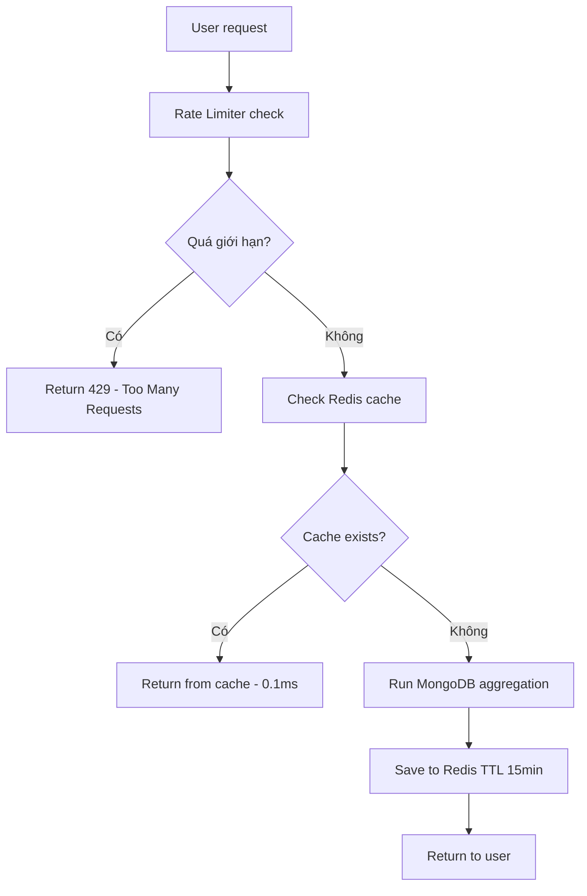
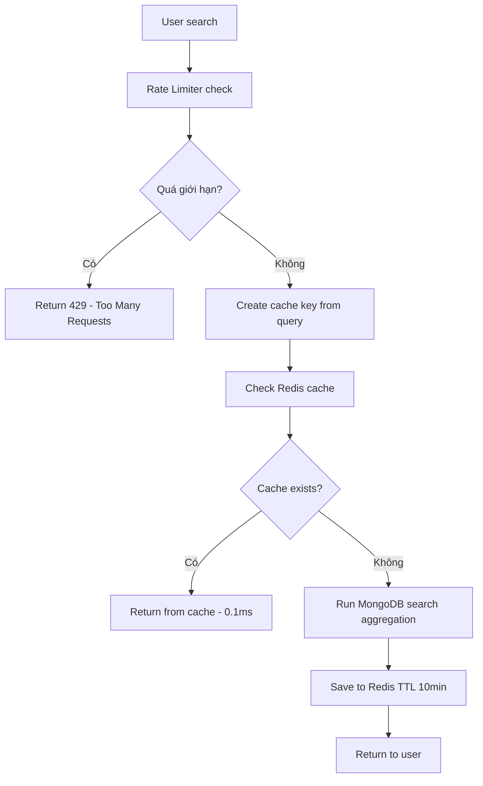
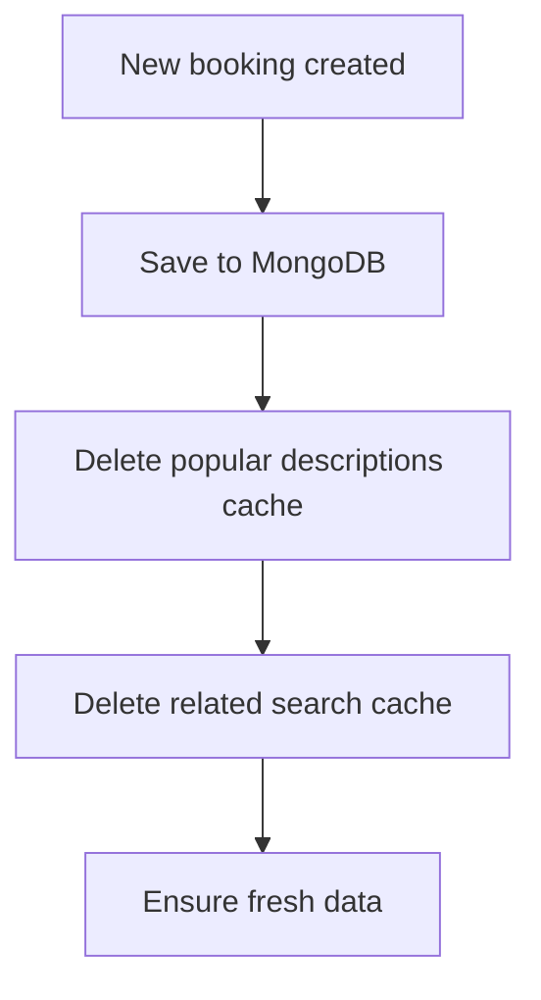

# Backend Optimization với Redis Cache và Rate Limiting

## Tổng quan

Giải pháp tối ưu hóa backend sử dụng **Redis Cache** kết hợp với **Rate Limiting** để giải quyết các vấn đề:
- Race condition khi nhiều user cùng tạo booking
- Database overload do query aggregation liên tục
- API spam và abuse

## Kiến trúc giải pháp

```
Frontend (React) ←→ Backend (Express) ←→ Redis Cache ←→ MongoDB
                ↑                    ↑
            Error Handling      Rate Limiting
            (429 handling)      (100 req/15min)
```

## Luồng hoạt động hoàn chỉnh

### 1. **Popular Descriptions Flow**



### 2. **Search Descriptions Flow**



### 3. **Cache Invalidation Flow**



## Cấu hình Rate Limiting

### **Popular Descriptions API:**
- **Endpoint**: `GET /api/bookings/popular-descriptions`
- **Giới hạn**: 100 requests / 15 phút
- **Response khi vượt quá**: HTTP 429 + message "Quá nhiều request, vui lòng thử lại sau 15 phút"

### **Search Descriptions API:**
- **Endpoint**: `GET /api/bookings/search-descriptions`
- **Giới hạn**: 200 requests / 15 phút
- **Response khi vượt quá**: HTTP 429 + message "Quá nhiều request tìm kiếm, vui lòng thử lại sau 15 phút"

## Cấu hình Redis Cache

### **Cache Keys:**
```javascript
// Popular descriptions
`popular_descriptions_5`   // Top 5 descriptions
`popular_descriptions_10`  // Top 10 descriptions

// Search descriptions  
`search_descriptions_sửa_5`     // Search "sửa" limit 5
`search_descriptions_điện_5`    // Search "điện" limit 5
```

### **TTL (Time To Live):**
- **Popular descriptions**: 15 phút (900 giây)
- **Search descriptions**: 10 phút (600 giây)

## Frontend Error Handling

### **Rate Limiting Errors (429):**
```javascript
// Banner.jsx - Xử lý lỗi search
if (error?.response?.status === 429) {
    setFormError('Quá nhiều request, vui lòng thử lại sau 15 phút');
}

// SuggestionSlice - Xử lý lỗi Redux
if (action.error?.response?.status === 429) {
    state.searchError = 'Quá nhiều request tìm kiếm, vui lòng thử lại sau 15 phút';
}
```

### **Error Display:**
- **Popular descriptions errors**: Hiển thị khi không có search query
- **Search descriptions errors**: Hiển thị khi có search query
- **Visual feedback**: Icon lỗi + message + subtitle hướng dẫn

## Cài đặt và chạy

### **1. Cài đặt dependencies:**
```bash
npm install redis express-rate-limit
```

### **2. Cấu hình Redis:**
```bash
# Tạo file .env
REDIS_URL=redis://localhost:6379
```

### **3. Khởi động Redis:**
```bash
# Windows (WSL)
redis-server

# macOS/Linux
brew services start redis
```

### **4. Khởi động Backend:**
```bash
npm start
```

## Testing

### **Test Redis Cache:**
```bash
node src/scripts/testRedisCache.js
```

### **Test Rate Limiting Flow:**
```bash
node test_rate_limit_flow.js
```

### **Test Frontend Error Handling:**
1. Mở browser developer tools
2. Gửi nhiều request liên tiếp đến API
3. Kiểm tra hiển thị lỗi 429 trên UI

## Monitoring và Debug

### **Redis Operations Log:**
```javascript
console.log('Lấy popular descriptions từ Redis cache');
console.log('Chạy aggregation để lấy popular descriptions');
console.log('Đã xóa cache cho description:', newBooking.description);
```

### **Rate Limiting Log:**
- Tự động log khi user bị block (429 status)
- Headers: `X-RateLimit-Limit`, `X-RateLimit-Remaining`, `X-RateLimit-Reset`

## Lợi ích

| Khía cạnh | Trước | Sau (Redis + Rate Limiting) |
|-----------|-------|------------------------------|
| **Performance** | 100-500ms | 0.1-1ms (cache hit) |
| **Database load** | Cao | Thấp (chỉ khi cache miss) |
| **Security** | Không có | Có (rate limiting) |
| **Race condition** | Có thể xảy ra | Không xảy ra |
| **Scalability** | Thấp | Cao |
| **User experience** | Chậm | Nhanh + thông báo lỗi rõ ràng |

## Troubleshooting

### **Redis không kết nối được:**
- Kiểm tra Redis server có chạy không
- Kiểm tra REDIS_URL trong .env
- Backend sẽ fallback về query DB trực tiếp

### **Rate limiting không hoạt động:**
- Kiểm tra package express-rate-limit đã cài chưa
- Kiểm tra middleware đã được apply vào routes chưa
- Test bằng cách gửi nhiều request liên tiếp

### **Cache không update:**
- Kiểm tra cache invalidation logic
- Kiểm tra Redis TTL settings
- Clear Redis cache: `redis-cli flushall`

## Future Improvements

1. **Background Jobs**: Cron job để refresh cache định kỳ
2. **Cache Warming**: Pre-load cache khi app khởi động
3. **Distributed Rate Limiting**: Redis-based rate limiting cho multiple servers
4. **Metrics Dashboard**: Monitor cache hit rate, rate limiting stats
5. **A/B Testing**: So sánh performance với/sans cache